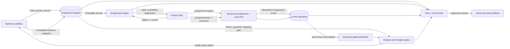

# VariantGrid architecture and data flow

VariantGrid keeps configuration, assignment, telemetry, analysis, and operator decisions separate so each boundary can be audited.

## Trust boundaries

1. **Configuration:** the registry serializes a canonical experiment version. Launch freezes variables, valid states, eligibility, allocation, assignment policy, metrics, attribution, stopping rule, and statistical method.
2. **Assignment:** the same immutable inputs produce the same bucket and state. The response contains version, state identity, probability, policy, bucket, and interval diagnostics.
3. **Exposure:** assignment is not counted as exposure. The SDK records exposure only when the product retrieves a real assigned value.
4. **Ingestion:** stable event and batch identifiers make retry effects idempotent. Event and receipt time remain distinct. Invalid or conflicting payloads are visible as dead letters.
5. **Attribution:** reconciliation orders by event time and admits only outcomes causally after a same-version exposure and inside the declared window.
6. **Decision:** SRM, sample size, guardrail, heavy-tail, stale-configuration, version, and sequential-monitoring failures suppress a recommendation before effect interpretation.
7. **Reproduction:** a clean-copy runner reruns tests and benchmarks, applies the declared thresholds, and writes machine-readable result artifacts.

## Runtime variants

The direct assignment engine, local API adapter, and Python SDK share the same evaluator and frozen parity fixture. The event repository contract runs unchanged against SQLite and PostgreSQL. The Postgres adapter additionally proves transactional contention across 16 connections plus durable retry and dead-letter replay after reopen.

The operator dashboard is a process-local sandbox. SDK/API assignment,
exposure, and outcome events feed real local event-derived plots and a
reconciliation trace. Health-failure controls and the decision-effect panel are
still explicit fixtures; the live local path does not establish production
telemetry durability, authentication, or availability.

## Failure behavior

- Invalid or empty state spaces block launch.
- Unsupported assignment algorithms and policies fail before exposure.
- Ineligible subjects and service outages return explicit safe fallbacks.
- Duplicate delivery does not change analytical counts; conflicting reuse of an ID is quarantined.
- Missing, pre-exposure, out-of-window, and cross-version outcomes do not enter default readouts.
- Integrity failures withhold effects and prevent recording a positive decision.

See [EVIDENCE.md](EVIDENCE.md) for the exact tests and generated artifacts behind each capability.
